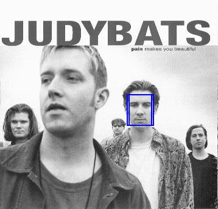

# NCC-face-detection

Simple python implementation using normalized cross correlation and gaussian pyramid for object detection in a scaled representation. The program will find and mark all locations in the pyramid at which the normalized cross correlation (NCC) of the template with the image is above the threshold.

## Running the program 

There are two images provided already, you can test it out by first constructing a gaussian image pyramid by calling MakePyramid() with the image as the parameter. Then call FindTemplate() with the image pyramid, template, and a self defined threshold correlation value between -1.0 and 1.0

### Example of usage

>image = Image.open(jpeg0) 
>template_im = Image.open(jpeg1) 
>pyramidlst = MakePyramid(image, 90) 
>result = FindTemplate(pyramidlst, template_im, 0.618)

### Example

Example: 
 
 

